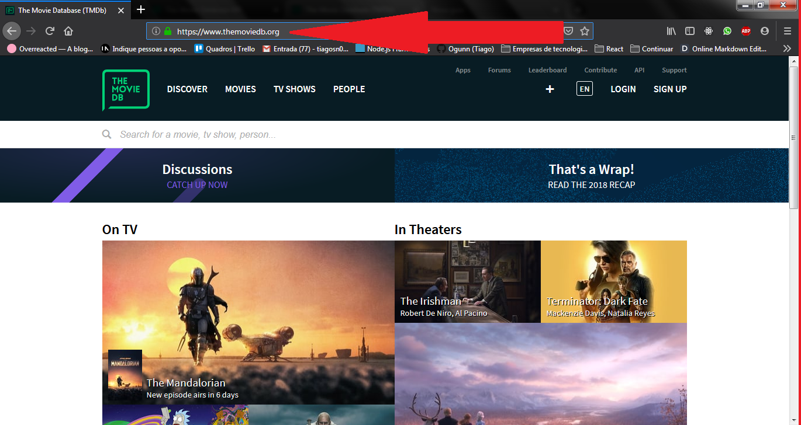

# O que é um desenvolvedor frontend?

Antes de responder essa pergunta, tenho que ter certeza de que meu interlocutor e minha interlocutora compreendem o que é uma "aplicação web" (do inglês web application, também abreviado para web app).

# O que é uma aplicação web?

É um software que é executado em um navegador web (web browser).

Um exemplo:

  - **Doogle Docs** é uma aplicação web que utilizamos para editar textos.
  - **Microsoft Word**, que também é utilizado para edição de textos, NÃO é uma aplicação web. Ele é um tipo de software chamado de aplicação desktop, que englobam os softwares que precisamos instalar em nossos computador para podermos utilizar.

Agora que já sabemos que uma aplicação web é execultada no navegador, precisamos enterder melhor como acontece essa execulção.

# Como o navegador execulta uma aplicação?

O ciclo de vida de uma aplicação web começa quando o usuário digita um endereço na barra de endereços do navegador. Por exemplo: https://www.themoviedb.org.

**URL: endereço**

- Uma URL é um identificador. Ela identifica o servidor ao qual queremos nos conectar.

Depois de digitarmos o endereço do servidor na barra de endereços do navegador, este irá fazer uma conecção (**requisição** é o termo técnico) ao servidor que entregará uma página HTML como resposta. Depois de receber esse arquivo HTML do servidor, o navegador irá exibi-lo para o usuário.

Mas voltando à pergunta que nos interessa no momento: **Como o navegador execulta uma aplicação?**. Já chegaremos nessa resposta. Antes, no entanto, precisamos entender o que é HTML e CSS.

## HTML

É um arquivo de texto. Um arquivo HTML é apenas isso. No entanto, ao contrário de outros tipos de arquivos de texto, como os arquivos do Word, o texto HTML é legível tanto por seres humanos quanto por computadores.
Como assim? Quando escrevemos um texto no Word, para definirmos um título simplismente aumentamos o tamanho da fonte. Isso é significativo para um ser humano, mas não para o computador. No arquivo HTML, temos um conjunto de tags (etiquetas em inglês) que irão informar para o computador o que é cada coisa: um título, um parágrafo, uma foto, um link etc.
